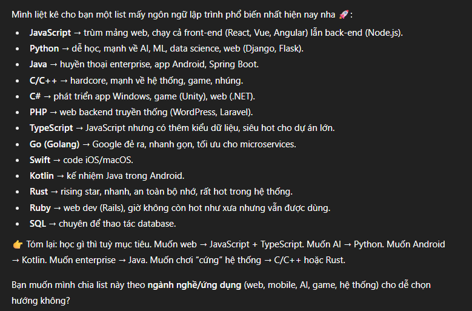
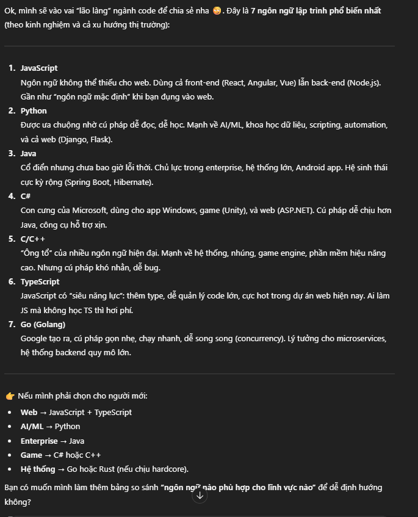

- prompt: `Liệt kê các ngôn ngữ lập trình phổ biến.`
- kết quả AI trả về:

vì AI hiện tại của em đã được custom về cách phản hồi phù hợp với người dùng nên nó trả lời khá đầy đủ với prompt hiện tại. Còn bên dưới là phản hồi cho prompt đã chỉnh sửa: `Với tư cách là một lập trình viên lâu năm trong ngành, bạn hãy liệt kê 7 ngôn ngữ lập trình phổ biến nhất dưới dạng danh sách đánh số kèm với một mô tả ngắn.`

